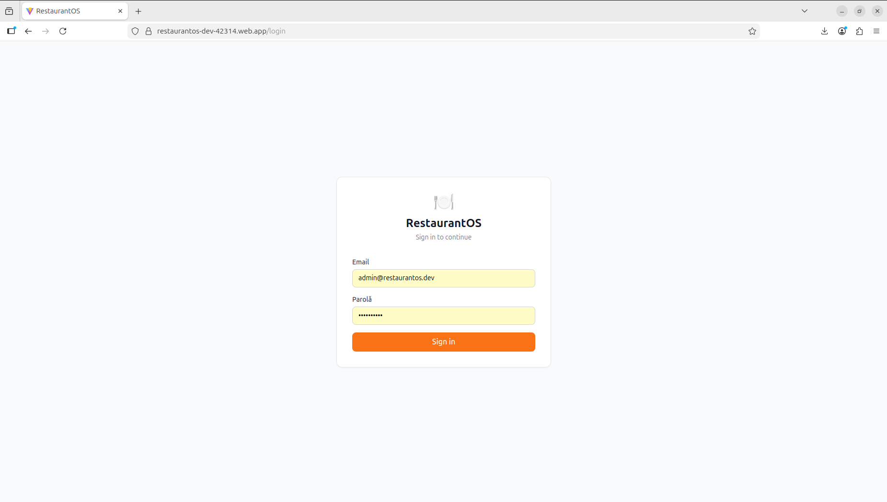
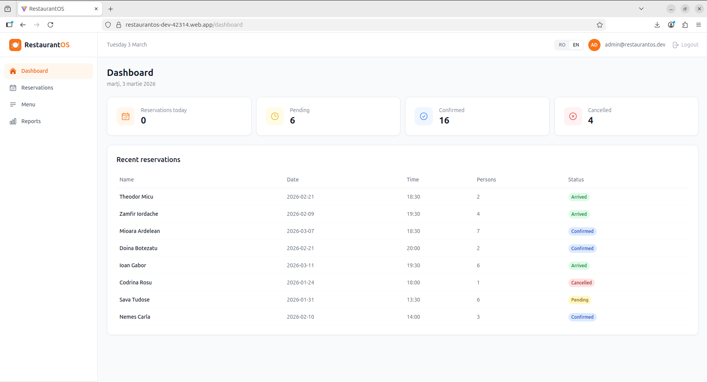
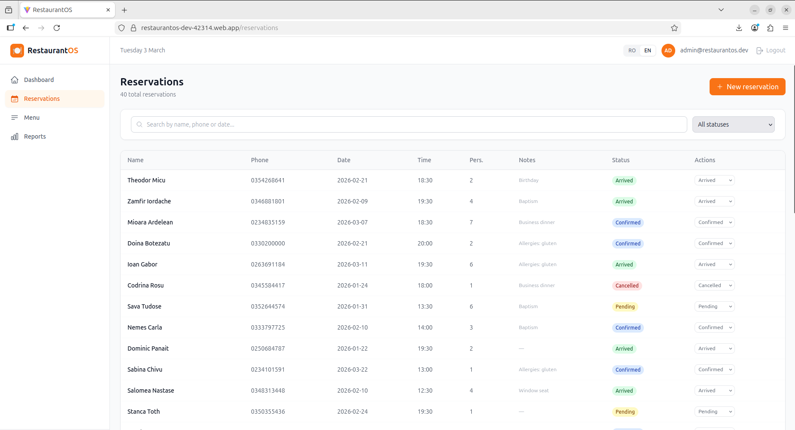
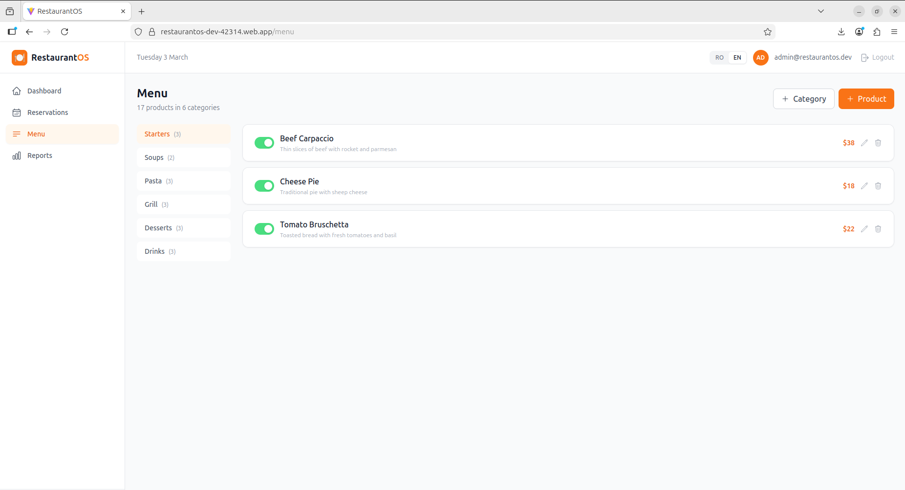
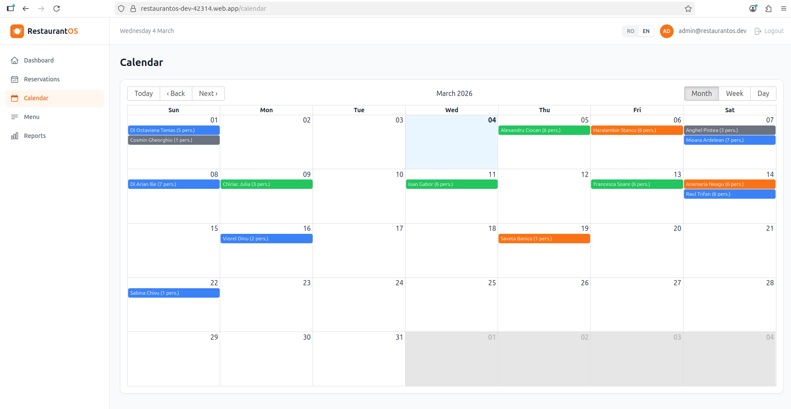
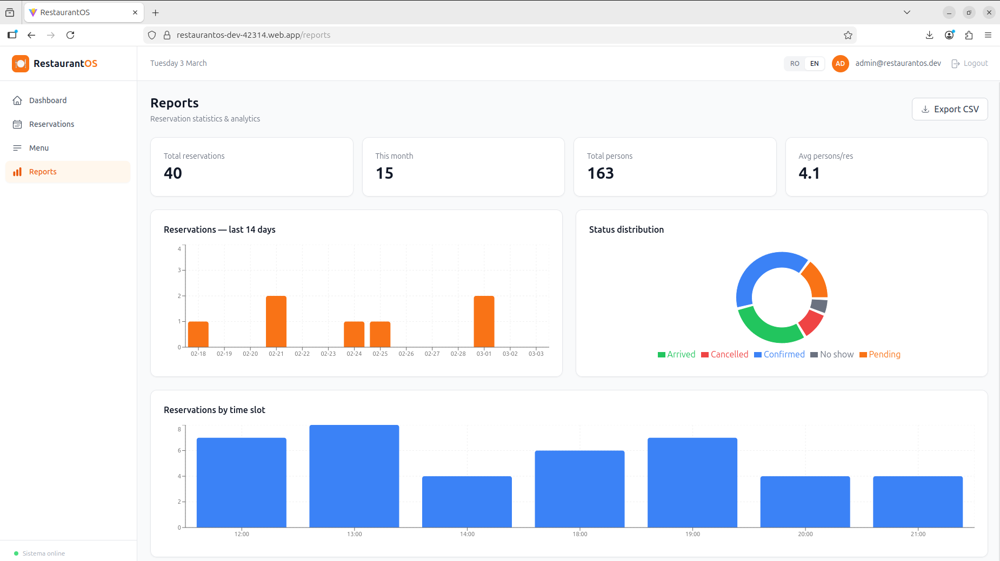
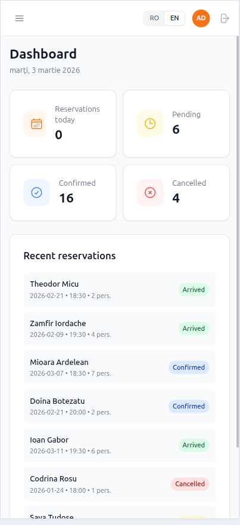
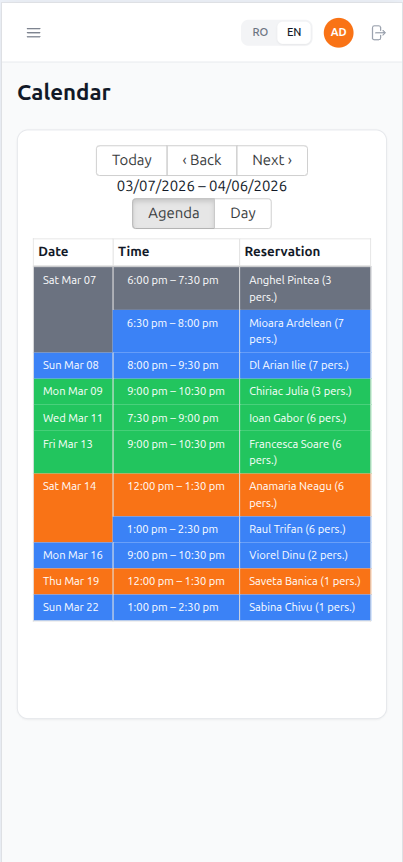

# RestaurantOS

[](https://restaurantos-dev-42314.web.app)
[](https://react.dev)
[](https://firebase.google.com)
[](https://tailwindcss.com)

RestaurantOS is a full-stack restaurant management dashboard built with React and Firebase. It helps restaurant managers handle reservations, manage their digital menu, and track business performance through real-time analytics. Features bilingual support (RO/EN) and full mobile responsiveness.

---

## 🔐 Demo Access

No registration needed — use the credentials below to explore the full admin dashboard:

| Field    | Value                                      |
|----------|--------------------------------------------|
| URL      | https://restaurantos-dev-42314.web.app     |
| Email    | demo@restaurantos.app                      |
| Password | Demo1234!                                  |
| Role     | Admin — full access to all features        |

---

## Screenshots

| | |
|---|---|
|  *Login Page* |  *Dashboard with KPI cards* |
|  *Reservations management* |  *Digital menu management* |
|  *Visual calendar* |  *Reports & Analytics* |
|  *Mobile responsive* |  *Calendar — mobile agenda view* |

---

## Features

- 🔐 **Firebase Authentication** (email/password)
- 📅 **Reservations management** with real-time sync
- 📅 **Visual calendar** with month/week/day views and status color coding
- 🍽 **Digital menu** with categories and products (toggle availability)
- 📊 **Analytics dashboard** with charts (last 14 days, status distribution, hourly breakdown)
- 🌍 **Bilingual interface** (Romanian / English)
- 📱 **Fully responsive** (mobile + desktop)
- 📤 **CSV export** for reservations
- ⚡ **Real-time updates** via Firestore onSnapshot

---

## Tech Stack

| Category | Technology |
|---|---|
| Frontend | React 18 + Vite |
| Styling | Tailwind CSS v3 |
| Backend & DB | Firebase Firestore |
| Authentication | Firebase Auth |
| Charts | Recharts |
| Routing | React Router v6 |
| Forms | React Hook Form |
| Hosting | Firebase Hosting |

---

## Getting Started

### Prerequisites

- Node.js 18+
- npm
- Firebase account

### Installation

```bash
# 1. Clone the repository
git clone https://github.com/tudorsorinoltean/restaurantos.git
cd restaurantos

# 2. Install dependencies
npm install

# 3. Configure environment variables
cp .env.example .env
```

Edit `.env` and fill in your Firebase project credentials:

```env
VITE_FIREBASE_API_KEY=your_api_key
VITE_FIREBASE_AUTH_DOMAIN=your_project.firebaseapp.com
VITE_FIREBASE_PROJECT_ID=your_project_id
VITE_FIREBASE_STORAGE_BUCKET=your_project.appspot.com
VITE_FIREBASE_MESSAGING_SENDER_ID=your_sender_id
VITE_FIREBASE_APP_ID=your_app_id
```

```bash
# 4. Start the development server
npm run dev

# Optional: populate Firestore with demo data
npm run seed
```

---

## Project Structure

```
src/
├── components/
│   └── layout/
│       ├── Header.jsx
│       ├── Layout.jsx
│       └── Sidebar.jsx
├── hooks/
│   └── useAuth.js
├── lib/
│   └── firebase.js
├── pages/
│   ├── auth/
│   │   └── LoginPage.jsx
│   ├── dashboard/
│   │   └── DashboardPage.jsx
│   ├── menu/
│   │   └── MenuPage.jsx
│   ├── reports/
│   │   └── ReportsPage.jsx
│   └── reservations/
│       └── ReservationsPage.jsx
├── services/
│   ├── auth.service.js
│   ├── menu.service.js
│   └── reservations.service.js
├── store/
│   └── useLanguage.js
└── utils/
    ├── constants.js
    └── translations.js
```

---

Built by Tudor Sorin Oltean — tudorsorinoltean@gmail.com
